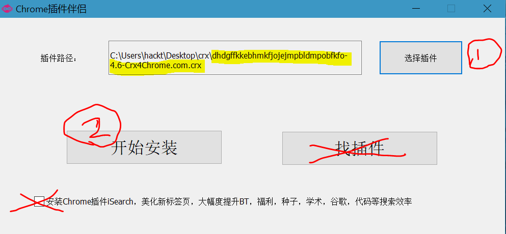
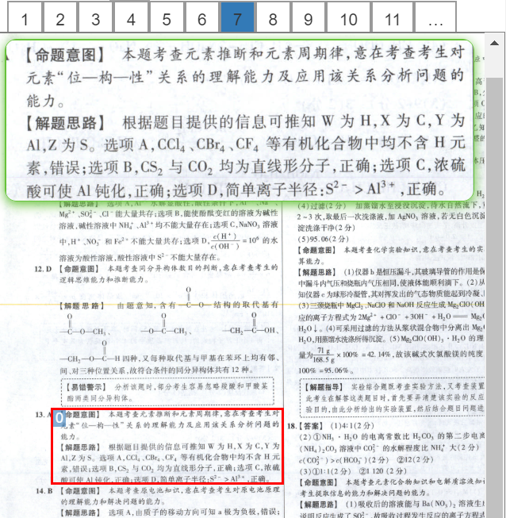
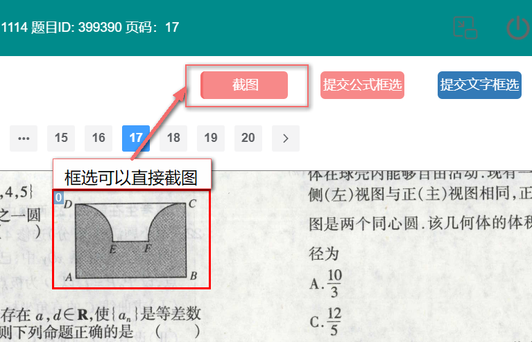
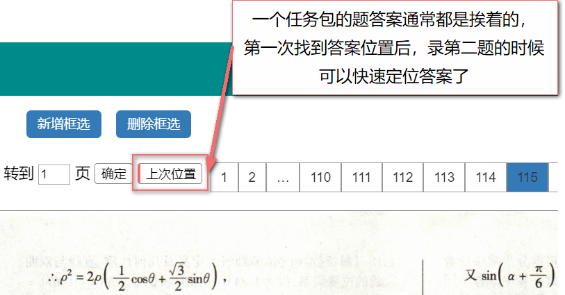
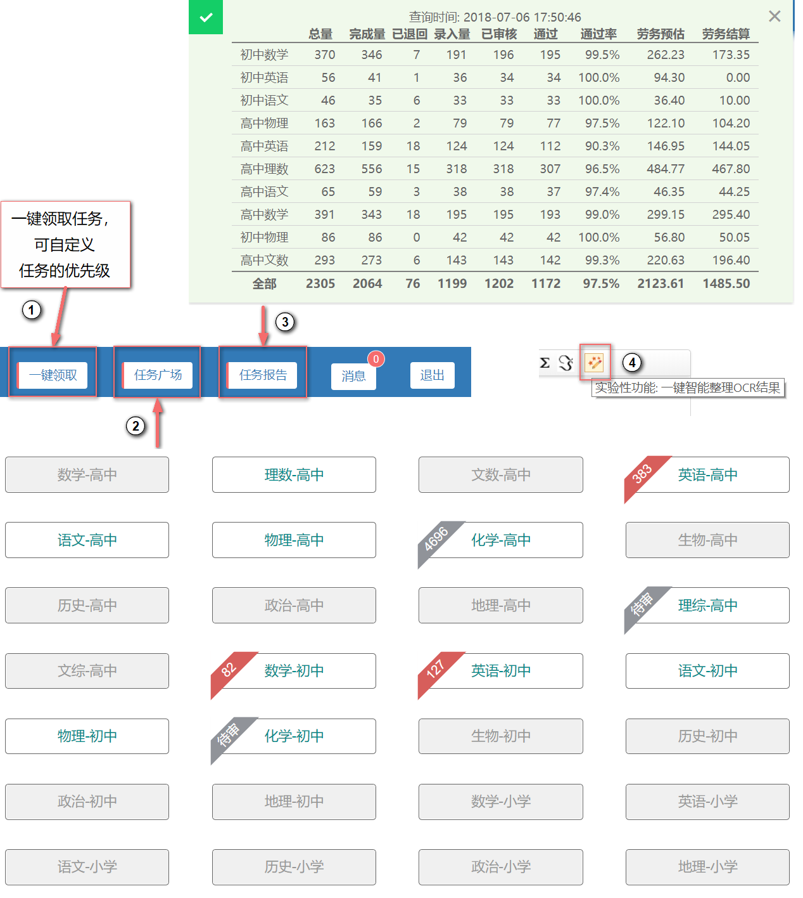
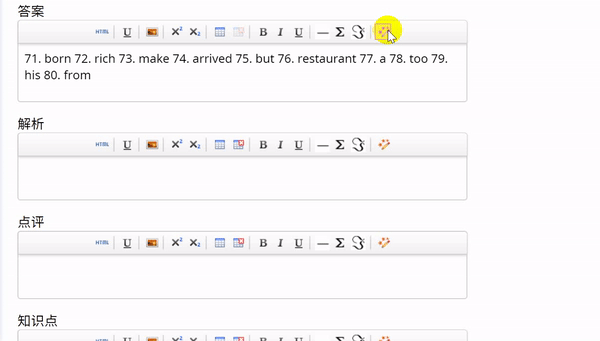
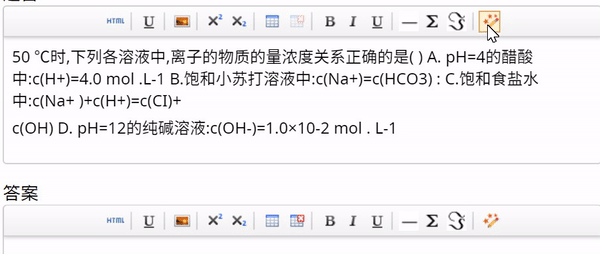
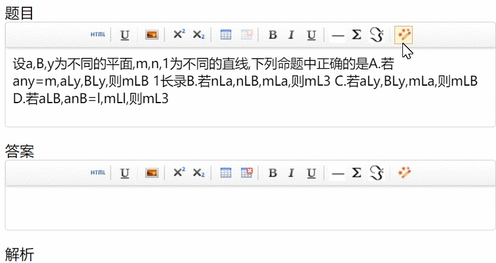
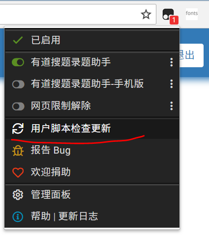

# 有道搜题录题助手手册
脚本版本: v1.0.051, by 徐。 

## 安装

1.安装油猴插件  
(1)下载油猴离线安装包:  
[点我下载油猴离线安装包](https://github.com/jacktsui/jscore/raw/master/manual/tm.zip)  
(2)安装油猴 
  
插件路径：刚下载的压缩包里就有，解压到哪里就去哪里找！  

2.提示安装成功后,在chrome地址栏输入:  
chrome://extensions/  
打开chrome插件管理器，启用油猴插件  
然后点击：  
https://github.com/jacktsui/xusqa/raw/master/xusqa.user.js  
安装脚本  

## 目录  
[最近更新](#最近更新)  
[基本功能介绍](#基本功能介绍)  
[智能整理](#智能整理)  
[安装前准备](#安装前准备)  
[安装](#安装)  
[脚本自动更新](#脚本自动更新)  

**因脚本在持续更新，部分截图可能和最新版本有出入**

### 最近更新
- **`最近更新：2018.07.17 添加放大镜(书本大纸张时看不清)和框选文字(用于替代系统框选不准)功能。及其他系统优化`**    

- **`最近更新：2018.07.10 添加框选截图功能。`**  
现在可以直接在录题界面截图了，不用使用外部工具来回切换了，题目的截图自动插入题目录入框，答案的截图直接插入解析录入框。配合QQ截图(ctrl+alt+a,qq截图后会自动复制到剪切板，在编辑框按ctr+v就可以粘贴，也很方便，但一占用了剪切板，二图小的时候截的图太小)食用效果更佳。  

- **`最近更新：2018.07.07 定位答案添加定位到“上次位置”`**。  

### 未来计划
**未来计划: 重点维护一键智能整理功能,提高录题效率是脚本的终极目标**

### 基本功能介绍
本助手为油猴(Tampermonkey)脚本，主要功能有：
- 一键领取任务
- 增强任务广场，任务数量以角标显示
- 任务报告：汇总录入和审核情况
- 一键智能整理  

(功能图)

### 智能整理
实验性功能:  
可以自动排版,修复部分OCR识别错误,自动添加分隔符,换行,上下角标等等;整理前最好先把一些关键字符的识别错误进行修正,用好了可以提高不少效率.  
部分功能展示
- 英语  
  

- 化学  

- 数学  

### 脚本自动更新

脚本持续开发更新中,可以使用以下方法更新脚本
